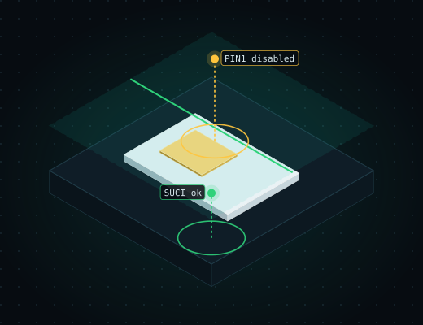

<p align="center"></p>

<h1> sim-doctor</h1>

<p>
  <a href="https://github.com/doctor-labs/sim-doctor/actions/workflows/ci.yml"></a>
  <a href="https://www.npmjs.com/package/sim-doctor"></a>
  <a href="https://crates.io/crates/sim-doctor"></a>
  
  <a href="LICENSE"></a>
  
  
</p>

**CLI-first SIM / UICC / eUICC security doctor: what does this card expose?**

`sim-doctor` examines a card over PC/SC and reports what it found through both a
terminal table and one stable JSON envelope with a meaningful exit code, so the same
binary serves an operator and an automated agent. **Its rules cover access conditions, PIN state, risky services and 5G
SUCI privacy, and not yet crypto or eUICC weaknesses: see [Status](#status) before you trust a
clean result.**

```text
sim-doctor: warning: the walk stopped early, so this is not the whole card; bounds hit: maximum path depth
sim-doctor: warning: the TAR scan did not finish, so its findings are partial: the operator asked for no TAR probing
WARNING: INCOMPLETE: 5 coverage gap(s); findings may be missing
ERROR: TRUNCATED: this walk did NOT see the whole card; a file outside it is neither present nor absent here; first bound hit: depth; every bound h...
WARNING: the TAR scan did not finish, so its findings are partial: the operator asked for no TAR probing
WARNING: score: the TAR audit probed nothing, so the MSL 0 check did not run: this score says nothing about whether the card refuses TAR 0, because...
NOTE: the default candidate set (SimFamilies) probes the five GSM 11.11 identifier families 2Fxx/4Fxx/5Fxx/6Fxx/7Fxx only; a file whose identifier ...
WARNING: 30 repeated identifier(s) in the walk (a directory that lists one of its own ancestors)
NOTE: 2591 walk note(s) on individual files; `--json` lists them
sim-doctor 0.4.0  score 0/100 critical
high  filesystem/config-ef-updatable-always 3F00/ADF:A0000000871002FFFFFFFF8917050000/6F56  EF.EST is updatable without ver...
high  filesystem/config-ef-updatable-always 3F00/7FFF/6F38  EF.UST is updatable without ver...
high  filesystem/config-ef-updatable-always 3F00/ADF:A0000000871002FFFFFFFF8917050000/6F38  EF.UST is updatable without ver...
[... 58 lines omitted ...]
low  identity/readable-without-pin 3F00/7FFF/6F3B  EF.FDN is readable without a PIN, so th...
44 high · 10 medium · 8 low
```

This is `sim-doctor scan` run in the CI swSIM job against the swSIM software SIM ([run](https://github.com/doctor-labs/sim-doctor/actions/runs/38072521788/job/114272709312)): the default doctor-kit face, whose notes come first, trimmed to the notes, the first findings and the summary (column padding squeezed, long lines cut at 150 characters, 58 finding lines omitted).


## Install

| Way | Command |
| --- | --- |
| npx | `npx sim-doctor <args>` downloads the matching release binary once into `~/.cache/sim-doctor` and checks its SHA-256 |
| cargo | `cargo install sim-doctor` |
| Prebuilt binary | download `sim-doctor-<target>.tar.gz` (and its `.sha256`) from [Releases](https://github.com/doctor-labs/sim-doctor/releases): `aarch64-apple-darwin`, `x86_64-apple-darwin`, `x86_64-unknown-linux-gnu`, `aarch64-unknown-linux-gnu` |

The npm package, the crate and the binaries are all published by the tagged-release workflow.
From a checkout, `cargo build --release` builds the same binary.

Linux needs `libpcsclite` (build: `libpcsclite-dev`, run: `pcscd`). macOS uses the
built-in PCSC framework.

Raspberry Pi 4/5 (Debian 13 trixie, aarch64): `sudo apt install pcscd libccid`, then download the
`aarch64-unknown-linux-gnu` binary or run `npx sim-doctor`. The Linux binaries are built on Ubuntu 24.04,
so they need glibc 2.39 or newer (Debian 13 has 2.41; Debian 12 is too old, build from source there).

## Use

| Command | What it does |
| --- | --- |
| `sim-doctor scan` | walk the card and report; `--json` for the doctor/1 envelope, `--sarif FILE` for SARIF, `--tui` for the terminal view, `--baseline FILE` to gate on new findings |
| `sim-doctor shell` / `explore` | browse the card's findings and files: an interactive shell, and a full-screen explorer ([below](#explore-a-card)) |
| `sim-doctor mcp` | serve the scan and rules to agents over stdio ([MCP server](#mcp-server)) |
| `sim-doctor fix <rule-id> --from FILE` | print (or launch an agent with) a prompt for one finding |
| `sim-doctor install` | write the agent skill and rules into a project |

The rest (`ts48`, `gp`, `euicc`, `trace`, `rules`, `why`) is in the [CLI reference](#cli-reference).

## Contents

- [Get started](#get-started)
- [Install](#install)
- [Use](#use)
- [CLI reference](#cli-reference)
- [Machine output and exit codes](#machine-output-doctor1)
- [GitHub Action](#github-action)
- [Agent integration](#agent-integration)
- [What it will not tell you](#what-it-will-not-tell-you)
- [Status](#status)
- [Documentation](#documentation)
- [Privacy and telemetry](#privacy-and-telemetry)
- [Design principles](#design-principles)
- [License](#license)

## MCP server

`sim-doctor mcp` serves six tools over stdio (JSON-RPC 2.0, MCP protocol 2024-11-05) so a coding agent can call sim-doctor without shelling out:

- `scan`: a card scan; needs a card and a reader. Its arguments are generated from `scan --help`.
- `rules_list`: the rule catalogue. No card.
- `rules_explain`: one rule by `id`. No card.
- `euicc_info`, `euicc_profiles`, `euicc_notifications`: the read-only `euicc` commands below, one optional `reader` argument each; they return the lpac envelope of `euicc <sub> --json` byte for byte. Need an eUICC and a reader. The eUICC writes (`nickname`, `enable`, `disable`, `delete`, `reset`, `notifications remove`) are deliberately not MCP tools.
- `gp_info`, `gp_ara`, `gp_status`: the read-only `gp` commands below, one optional `reader` argument each; they return the envelope of `gp <sub> --json` byte for byte. Need a card and a reader.

Every `scan` flag is an argument (`baseline`, `fail-on` and `sarif` included) except `tui`, `json` (always on), `help` and `version`; `baseline` and `sarif` take a file path, as on the command line. Each call runs `sim-doctor` itself as a subprocess and returns its doctor/1 envelope byte for byte as the tool text. Exit 0, 1 and 3 are normal results (isError false): findings at or above `--fail-on`, or a new finding against a baseline. 2 (the scan could not run: its envelope has `data.error`), 130 or any other exit is a tool error (isError true) carrying the child's stderr. Arguments are validated first: an unknown property, a wrong type or a string value starting with `-` is refused without running anything.

Calls are handled serially, one at a time. Each child is killed after 300 seconds (override with `SIM_DOCTOR_MCP_TIMEOUT_SECONDS`; 0 or a non-number means the default) and the call returns an error saying it timed out. Captured stdout and stderr are each capped at 16 MiB; a truncated result is an error and says so. A scan holds the PC/SC reader only while its child runs, so the reader is released when the scan finishes or is killed. Ctrl-C ends the server.

Tested through the real process: the initialize, tools/list and tools/call handshake, `rules_list`, refusal of arguments the server does not expose, and Ctrl-C. `scan` itself is not exercised through the server (it needs a card). Acceptance by specific agent clients is unverified.

## Get started

### 1. Install

```sh
cargo install sim-doctor
```

More ways in [Install](#install). You also need a PC/SC reader and a card, or the
software card in [docs/swsim-fixture.md](docs/swsim-fixture.md).

### 2. First scan

```sh
sim-doctor scan --json
```

With no reader attached, this is the real output, and it exits `2`:

```json
{"data":{"card_touched":false,"error":{"kind":"no-reader","message":"no PC/SC reader is attached. Start pcscd and attach a card, or see docs/swsim-fixture.md for the software SIM this project tests against"},"scanned":false},"exit_code":2,"findings":[],"schema":"doctor/1","score":{"coverage_gaps":1,"label":"critical","model":"sim/1","value":0},"tool":"sim-doctor","version":"0.4.0"}
```

With a card, `findings` and `score` are the result and `data` carries the file tree, the dialect
it was read under, `complete` / `truncated` / `limits_hit`, and the rest of the report. The
exit code is `0` or `1` by `--fail-on` (see [Machine output](#machine-output-doctor1)), **not** by whether
the walk finished: read `data.complete` (or require `score.coverage_gaps` to be 0) before trusting a clean result.

### 3. Score and probe TARs

```sh
sim-doctor scan --json --score --tar focused
```

`--tar focused` probes 592 TARs for MSL 0 (`gsma/msl-zero-allowed`). Without it the scan
still checks PIN1 status, EF access conditions and the 5G SUCI configuration from the FCPs, EF.ARR and
EF contents, read-only (`sim-doctor rules list`; each rule is documented in
[docs/rule_docs](docs/rule_docs)). The JSON always carries `score` (an integer 0-100, `data.score_detail.rules_run` beside it); `--score` adds it to the human report. A 100 with `rules_run` 0 means
nothing was checked, and the report says so in words.

### 4. Hand it to an agent

```sh
sim-doctor install
```

```
wrote ./.claude/skills/sim-doctor/SKILL.md
wrote ./.cursor/rules/sim-doctor.mdc
wrote ./AGENTS.md
```

## Terminal view

`sim-doctor scan --tui` shows the findings in an interactive terminal view: the count per severity, the score
when `--score` is on, a list (severity, rule id, message; critical and high red, medium yellow, low blue, info
grey) and a detail pane for the selected finding (location, coverage reason when partial, evidence), plus the
coverage and TAR-stop notes. The status area at the top always shows the score warning, walk-stop and truncation notes, candidate warning and diff counts when the JSON has them. Keys: up/down or j/k, PgUp/PgDn, Home/End, Tab to scroll the detail pane, q, Esc or Ctrl-C to quit. SIGINT and SIGTERM also exit cleanly and restore the terminal (`sim-doctor mcp` and a launched `fix` agent keep the default disposition for both and just end).

It is a view over the data `--json` carries and never shows anything the envelope lacks. It cannot be combined
with `--json` (usage error, exit 2). When stdin or stdout is not a terminal it prints the normal report and
writes `sim-doctor: --tui needs a terminal; showing the plain report` to stderr. The rendering is unit-tested
against an in-memory backend; the interactive loop is **not** tested against a real terminal in CI.

## Explore a card

`sim-doctor shell` reads the card once (the same walk as `scan`, no TAR audit unless `--tar` asks for one) and opens a
shell over it: the findings by category, and under `card` the file system, one directory at a time (`cd card`,
`cd 3F00`, `ls`, `info 2FE2`, `cat 6F07`, `decode`, `find`). `shell -c "ls; cd card; ls"` runs commands and exits;
`--json` prints one `doctor-shell/1` record per reply, for agents. `sim-doctor explore` is the full-screen version of
the same session (`hjkl`, enter, `/` filter, `d` decode, `w` why, `x` export, tab, `q`). Both take `--reader`,
`--dialect`, the walk bounds and `--tar`; both read only (SELECT, READ BINARY, READ RECORD), come from doctor-kit and are
on by default (build with `--no-default-features` to leave them out).

`scan` prints the findings with a doctor-kit face by default (rich on a terminal, plain when piped), preceded by notes for
everything that makes the result partial (a truncated walk, an unfinished TAR audit, the candidate-set warning).
`--face rich|plain|compact`, `--theme mono|clinical|contrast`, `--color auto|always|never` and `--headless` choose the
look; `--face legacy` prints the full report with the files and the TAR evidence. `--json`, `--sarif`, `--baseline` and the
exit codes do not change. `scan --tui` is still the findings view described above.

## CLI reference

| Command | What it does |
| --- | --- |
| `scan` | select the master file, walk the card, report |
| `ts48 compare [--json] [--reader NAME] [--dialect TABLE] [walk bounds]` | walk the card (read-only, no TAR probes) and diff its file system against the public GSMA TS.48 test profile; see below |
| `install [--agent claude\|cursor\|codex\|opencode] [--print-only] [--dir DIR]` | write agent guidance into a project |
| `modules [--json]` | describe the crate's module roots and layering |
| `completions <shell>` | shell completion script for the whole flag surface |
| `rules list\|explain <id>`, `why <rule-id\|FILE>` | what a rule means and how to fix it, from the catalog or a saved `scan --json` envelope; no card needed |
| `fix <rule-id> --from FILE [--agent claude\|codex\|cursor] [--skip-approvals]` | print a prompt for one finding of a saved `scan --json` envelope; `fix` strips zero-width joiners (U+200C/U+200D), the combining grapheme joiner and variation selectors from agent-bound text, so emoji ZWJ sequences and Persian/Indic shaping marks are removed; unassigned code points and some other Cf characters (e.g. U+0600-0605, U+06DD) are NOT stripped. card text is fenced as untrusted data; with `--agent` it starts that coding agent, which keeps its own approval prompts unless `--skip-approvals`; nothing is launched when already inside an agent; `SIM_DOCTOR_HANDOFF_SKIP_APPROVALS=1` is the same as `--skip-approvals`; an agent that is not installed exits 1, and one killed by a signal exits 128+signal. The skip flags (`--dangerously-skip-permissions`, `--dangerously-bypass-approvals-and-sandbox`, `--force`) are copied from the sibling tool android-doctor and are not verified against every CLI version |
| `gp info\|ara\|status [--json] [--reader NAME] [--trace]` | read-only GlobalPlatform reads, see below |
| `gp status --keys-file PATH \| --keys-env VAR [--key-version HEX]` | registry over an SCP03 secure channel, one authentication attempt, see below |
| `gp select --aid HEX [--json] [--reader NAME] [--trace]` | SELECT an application by AID, see below |
| `gp channel open\|close --channel N [--json] [--reader NAME] [--trace]` | MANAGE CHANNEL; every `gp` command takes `--channel N` (0 to 19) to run on that channel, see below |
| `gp delete --aid HEX [--related] [--keys-file PATH \| --keys-env VAR] [--yes]` | DELETE over SCP03, **changes the card**, dry run unless `--yes`, see below |
| `gp install --load CAP [--module HEX] [--app HEX] [--params HEX] [--privileges HEX] [--dap-key-file PATH \| --dap-key-env VAR] [--dap-sd HEX] [--dap-hash H] [--keys-file PATH \| --keys-env VAR] [--yes]` | INSTALL [for load] + LOAD + INSTALL [for install and make selectable] over SCP03, **changes the card**, dry run unless `--yes`, see below |
| `gp put-key --new-key-version HEX (--new-keys-file PATH \| --new-keys-env VAR) [--replace-key-version HEX] [--key-id HEX] [--replace-current-keyset] [--keys-file PATH \| --keys-env VAR] [--yes]` | PUT KEY of an SCP03 AES-128 key set over SCP03, **changes the card and can permanently lock administrative access**, dry run unless `--yes`, see below |
| `card [--reader NAME] [--profile uicc\|sim] [-c "cmd; cmd"] [--script FILE] [--json] [--yes]` | a pySim-shell style shell over the card, see below |
| `euicc info\|profiles\|notifications [--json] [--reader NAME] [--aid HEX] [--max-segment BYTES]` | read-only eUICC queries over ES10, see below |
| `euicc nickname ICCID NAME [--yes] [...]` | set a profile nickname; a dry run unless `--yes`, see below |
| `euicc enable\|disable ICCID\|AID [--yes] [...]` | enable or disable a profile; a dry run unless `--yes`, see below |
| `euicc delete ICCID\|AID [--yes] [...]` | delete a disabled profile permanently; a dry run unless `--yes`, see below |
| `euicc reset [--operational] [--test] [--smdp-address] [--confirm-eid EID] [--yes] [...]` | eUICC memory reset; needs `--yes` and `--confirm-eid`, see below |
| `euicc notifications remove SEQ [--yes] [...]` | remove a notification from the list; a dry run unless `--yes`, see below |
| `euicc notifications dump [--seq N] [-o FILE] [...]` | read the full signed pending notifications into a re-loadable JSON file; read-only, see below |
| `euicc notifications replay --from FILE [--yes] [--json]` | send dumped notifications to their operators over ES9+ HTTPS; a dry run unless `--yes`, see below |

`scan` flags (`sim-doctor scan --help` is the full contract):

| Flag | What it does |
| --- | --- |
| `--json` | one JSON envelope on stdout and nothing else; diagnostics go to stderr |
| `--reader <NAME>` | which PC/SC reader (default: the first) |
| `--dialect <TABLE>` | FCP tag table: `ts-102-221` (default, ETSI TS 102 221; real cards and swSIM) or `swicc` (same tags, own name). `iec-7816-4-table-42` is a deprecated alias for `ts-102-221` |
| `--max-depth`, `--max-children`, `--max-nodes`, `--max-directories` | walk bounds; hitting one is reported as truncation. `--max-nodes` (default 16384) counts files the card selected, not absent probes; walk time is bounded by `--max-directories` (64) x `--max-children` (1280). `ts48 compare` takes the same four flags |
| `--tar <SELECTION>` | TARs to probe for MSL 0: `off` (default), `focused`, `full`, `range:A-B`, `regex:P`; capped at 4096 probes |
| `--terminal-profile` | with `--tar` other than `off` only (else exit 2): send TERMINAL PROFILE `80 10 00 00 01 13` (SMS-PP data download declared, nothing else) before the TAR audit. **Changes the card's CAT session state** (no file is written); a pending proactive command is fetched and declined, never executed. Off by default |
| `--severity <LEVEL>` | drop findings below `info\|low\|medium\|high\|critical` |
| `--score` | show the score in the human report (the JSON always has `score`, integer 0-100) |
| `--fail-on <LEVEL>` | exit 1 (3 under `--baseline`) on a finding at or above `info\|low\|medium\|high\|critical`; default `critical` |
| `--baseline <FILE>` | compare with a previous `scan --json` envelope; only new findings gate (exit 3). Replaces the old `--baseline` writer and `--diff` |
| `--sarif <FILE>` | also write SARIF 2.1.0 |

### `ts48 compare`

Walks the card exactly as `scan` does (SELECT and GET RESPONSE only; no ENVELOPE, no TAR
probes) and diffs the files it found against the file list of the GSMA Generic eUICC Test
Profile (TS.48 v7.0, SAIP 2.3). GSMA publishes that profile under Apache-2.0 at
[GSMATerminals/Generic-eUICC-Test-Profile-for-Device-Testing-Public](https://github.com/GSMATerminals/Generic-eUICC-Test-Profile-for-Device-Testing-Public);
the list compiled into the binary is `tests/corpus/ts48/ts48-v7.0-files.json`, derived from the
pinned commit named in it. The profile package itself, which carries public test keys, is never
committed; `cargo test regenerates_the_fixture -- --ignored` re-derives the list from a download.

Findings go through the usual contract, rules `ts48/file-missing` and `ts48/file-different`
(low) and `ts48/file-extra` (info), and `data.summary` carries the counts
(`expected`, `matched`, `missing`, `extra`, `different`, `unverified`). A file under a directory
the card refused to select is `unverified`, not missing. Compared: file type, EF layout, size and
record length, each only when both sides state it. An operator SIM is not a TS.48 card, so
differences are the expected result and the exit code is 0 whenever the walk finished.

**Matching the TS.48 file structure is not GCF or PTCRB conformance.** This compares a file
system with a public test profile and certifies nothing. The walk's limits apply (the default
candidate set can miss a file). Applications are found the way a UICC exposes them: the walk
reads EF.DIR (`2F00`, READ RECORD only), SELECTs each AID, and lists its files as
`3F00/ADF:<AID>/6F07`; for the comparison the 3GPP USIM (`A0000000871002`) maps to the
profile's `7FD0` and ISIM (`A0000000871004`) to `7FC0`.

### `euicc`

Queries to an eUICC's ISD-R (SGP.22 ES10), named after lpac's, and three writes (`nickname`, `enable`, `disable`):

| sim-doctor | lpac | Asks the card for |
| --- | --- | --- |
| `euicc info` | `chip info` | EID (GetEID), the configured default SM-DP+ and root SM-DS addresses (ES10a GetEuiccConfiguredAddresses), EUICCInfo1 and EUICCInfo2 (GetEuiccInfo1/2): SVN, profile version, firmware, RSP capability, CI key ids, category |
| `euicc profiles` | `profile list` | GetProfilesInfo: ICCID, state, class, nickname, service provider, name, ISD-P AID |
| `euicc notifications` | `notification list` | ListNotification metadata only (sequence number, operation, address, ICCID); nothing is retrieved or removed (`notifications remove SEQ` below removes one) |

Each command opens a logical channel, selects the ISD-R by AID (`A0000005591010FFFFFFFF8900000100`,
`--aid HEX` overrides), sends one STORE DATA request and closes the channel again, also when it
fails. `--max-segment BYTES` (1 to 255, default 120 as in lpac; 255 is the short-APDU Lc limit) caps the data bytes in one STORE DATA block, because some eUICCs reject full 255-byte blocks. `info`, `profiles` and `notifications` change nothing. `--json` prints the lpac envelope
(`{"type":"lpa","payload":{"code","message","data"}}`); without it you get a table with
card-supplied text sanitized. Exit codes: `0` answered; `1` the card is not an eUICC (the ISD-R
SELECT was refused: `data.error.kind` is `not-an-euicc`), the card refused a logical channel or an
ES10 request, the response was malformed, or no reader or card; `129` bad command line; `130`
interrupted. The swSIM fixture is not an eUICC, so these are tested against synthetic responses
through the replay transport and still need a live-card check (tracked on #92). The online side
(download, discovery) is not here; `notifications replay` below is the one command that sends anything.

`euicc nickname ICCID NAME` (lpac `profile nickname`, ES10c SetNickname) is the first command here that
changes the card, and it is cautious by default. The ICCID (18 to 20 digits) and the name (at most 64
bytes of UTF-8, no control characters; `""` clears it) are checked before a reader is opened.
Without `--yes` it is a **dry run**: it reads the EID and the profile list, prints the target EID
and ICCID and the current and the new nickname, and exits 0 without sending SetNickname. With `--yes`
it sends SetNickname, re-reads the profile list and exits 1 (`verify-failed`) unless the nickname
changed. An ICCID the eUICC does not hold is `iccid-not-found`, and nothing is written. The nickname
write is **not exposed over MCP**: the MCP server offers the three read-only `euicc_*` tools only.

`euicc enable ICCID|AID` and `euicc disable ICCID|AID` (lpac `profile enable` / `profile disable`, ES10c
EnableProfile / DisableProfile, REFRESH requested) follow the same rules. The profile is an ICCID (18 to 20
digits) or an ISD-P AID (hex), checked before a reader is opened (`bad-profile-id`). Both read the EID and the profile
list first and refuse, sending nothing, an unknown profile (`profile-not-found`), enabling an enabled profile
(`already-enabled`) and disabling a disabled one (`already-disabled`). Without `--yes` they are a **dry run** that
says what would follow: enabling switches the active profile and the device loses its current connection until it
re-attaches; disabling the only enabled profile leaves no active profile. With `--yes` they send the request, map
each SGP.22 result code to its own error kind (`profile-not-found`, `profile-not-in-disabled-state` /
`profile-not-in-enabled-state`, `disallowed-by-policy`, `wrong-profile-reenabling`, `cat-busy`, `undefined-error`; an
unlisted code is `es10-refused`), re-read the profile list and exit 1 (`verify-failed`) unless the state changed.
Neither is exposed over MCP.

`euicc delete ICCID|AID`, `euicc reset` and `euicc notifications remove SEQ` (lpac `profile delete`,
`chip purge`, `notification remove`; ES10c DeleteProfile / eUICCMemoryReset, ES10b RemoveNotificationFromList)
erase things and follow the same rules: a **dry run** unless `--yes`, a verifying re-read (`verify-failed`),
validation before a reader is opened, each SGP.22 result code its own error kind (an unlisted code is
`es10-refused`), and no MCP exposure.

- `delete` refuses, sending nothing, an unknown profile and an **enabled** one (`profile-enabled`: run
  `euicc disable` first). The dry run states that the profile is erased permanently and can only come back by
  downloading it again from the operator. Kinds: `profile-not-found`, `profile-not-in-disabled-state`,
  `disallowed-by-policy`, `undefined-error`.
- `reset` can erase every profile. Nothing is selected by default: pick `--operational`, `--test` (field-loaded
  test profiles) and/or `--smdp-address` (reset the default SM-DP+ address), or it is refused
  (`no-reset-option`). Sending needs both `--yes` and `--confirm-eid <EID>`, and the EID must match the one read
  from the card (`confirm-eid-required`, `bad-eid`, `eid-mismatch`; nothing is sent). The dry run lists every
  profile that would be erased (provisioning profiles are never touched). Kinds: `nothing-to-delete`,
  `undefined-error`.
- `notifications dump [--seq N] [-o FILE]` (lpac `notification dump`, ES10b RetrieveNotificationsList) reads the full
  signed `PendingNotification`s, not just the metadata `notifications` lists, and writes one JSON document
  (`format` `sim-doctor-notification-dump/1`, `eid`, `notifications`): per notification the sequence number, operation,
  address, ICCID, arm (`profile-installation-result` or `other-signed-notification`), transaction id and the signed bytes
  as `pending_notification_hex`. It is read-only: retrieving removes nothing. Without `-o` and `--json` the document is
  printed to stdout; `-o FILE` writes it (the file must not exist). `--seq N` asks for one notification (lpac's
  search-criteria form, `notification-not-found` when the card has none); no pending notification is an empty list.
- `notifications replay --from FILE` sends each dumped notification to the `notificationAddress` inside its signed
  bytes (not the decoded field in the file) as ES9+ HandleNotification, `POST
  https://<address>/gsma/rsp2/es9plus/handleNotification`, through the HTTPS transport and `SIM_DOCTOR_HTTP` /
  `SIM_DOCTOR_CA_BUNDLE` of #20. **It reaches the network and tells the operator's server about a profile event**, so it
  is a dry run unless `--yes`: the dry run validates the file and every address and prints each target and request size,
  sending nothing and opening no connection. It needs no reader and never removes the notification from the eUICC
  (`notifications remove` stays the explicit step). Kinds: `bad-dump`, `bad-address` (checked before anything is sent),
  `replay-failed` (stops at the first refusal and reports what was sent). Not exposed over MCP. The tests run the send
  path against a local TLS test server; a live round trip with a real operator is on #92 and #118.
- `notifications remove SEQ` reads the notification list first and refuses a sequence number that is not in it
  (`notification-not-found`). The dry run states that a removed notification is never sent to the operator's
  server. Kinds: `nothing-to-delete`, `undefined-error`.

### `gp`

Read-only GlobalPlatform reads: SELECT, GET DATA and GET STATUS only (the writes `gp delete`, `gp install` and `gp put-key`
are described after the authenticated-read section).
`gp info` reads the ISD, CPLC, card data, key information and counters. `gp ara` selects the ARA-M
(`A00000015141434C00`) and reads every access rule (GET DATA `FF40`), decoding applet AID, device
app hash, APDU filters, NFC rule and permissions; a rule that lets every device app send any APDU to
every applet is marked `grants_all_apps_all_access`. `gp status` lists the ISD, applications and load
files (GET STATUS) with lifecycle and privilege names, and decodes Card Recognition Data, listing any
SCP01/SCP02 offered as `weak_scp`. A card that wants a secure channel (`6982`/`6985`) is reported as
`requires_authentication`, exit 0. `gp select --aid HEX` SELECTs any application and reports the
status word, FCI and DF name. Exit 1 when the ISD (or ARA-M, or the AID) does not answer SELECT. Human
output is sanitized; `--json` is the lpac envelope of kind `gp`. Tested against synthetic replay
responses only; not yet checked on a live card. Not done: a `scan` rule for the all-access ARA-M
rule (scan does not select the ARA-M).

**Authenticated `gp status` (issue #112, #19).** For a card that refuses GET STATUS without a secure
channel, give the ISD keys and the registry is read over SCP03 (AES-128, C-MAC only):

```
SIMDOC_KEYS='404142434445464748494A4B4C4D4E4F' sim-doctor gp status --keys-env SIMDOC_KEYS --json
sim-doctor gp status --keys-file ./isd.keys --key-version 30
```

The key text is `ENC [MAC [DEK]]`, 32 hex digits each, split by spaces, commas or newlines (one key
means ENC = MAC; the DEK is checked and not used). A key may be written `KEY/KCV` (6 hex digits): a
wrong KCV stops the run before a reader is opened. **Keys come from a file or an environment
variable only, never the command line** (shell history, process list), and are never printed.
That is the one exception to full visibility: no key, no session key and no key text appear in the
table, `--json`, SARIF or `--trace`, and error messages never quote the key text. The `--trace` wire
bytes hold cryptograms and C-MACs only. Use a `chmod 600` file.

**Lockout safety.** Failed authentications count toward permanently locking the ISD, so a run makes
exactly ONE attempt, never retries and never tries a second key. The card cryptogram from INITIALIZE
UPDATE is checked locally first (GP Amendment D 6.2.2); if it does not verify, the run stops with
"keys do not match this card" and EXTERNAL AUTHENTICATE is **not sent**, so a wrong key costs no
counter attempt. A refused EXTERNAL AUTHENTICATE is reported (`data.error`, exit 1) and not retried.
The card cryptogram proves the MAC key; the ENC key is not exercised at C-MAC level
(`enc_key_exercised: false`).

**Card writes: `gp channel`, `gp delete`, `gp install`, `gp put-key` (issues #133, #19, #115).** These change the card.

```
sim-doctor gp channel open                                    # the card picks N and it is printed
sim-doctor gp status --channel 1 --keys-file ./isd.keys       # any gp command on that channel
sim-doctor gp channel close --channel 1
sim-doctor gp delete --aid A0000000620001                     # dry run, offline: prints the APDU
sim-doctor gp delete --aid A0000000620001 --keys-file ./isd.keys          # dry run + registry check
sim-doctor gp delete --aid A0000000620001 --keys-file ./isd.keys --yes    # sends DELETE
sim-doctor gp install --load applet.cap --keys-file ./isd.keys --yes
```

`gp channel open` sends MANAGE CHANNEL (`00 70 00 00 01`) and leaves the channel open on the card
(until `gp channel close` or a power cycle); `--channel N` makes the SELECT, every following command
and the secure channel's C-MAC use that channel's class byte (GP Card Spec 11.1.4, channels 1 to 19).
`gp delete` sends `80 E4 00 <P2> .. 4F <len> <AID>` (`--related` sets P2 `80`: a load file and its
applications). `gp install` reads the CAP, then sends INSTALL [for load] (`80 E6 02 00`), the LOAD
blocks (`80 E8`, 240 bytes each) and INSTALL [for install and make selectable] (`80 E6 0C 00`),
into the ISD. `--module` is needed only when the CAP has several applets, `--app` defaults to the
module AID, `--params` is the Install Parameters TLV (must hold `C9`; default `C900`), `--privileges`
is 1 or 3 bytes (default `000000`; Card Lock and Card Terminate are refused).

**Safety, all enforced in code:** a write is a **dry run unless `--yes`**, and `--yes` needs
`--keys-file`/`--keys-env`. The dry run prints the target and the exact APDUs (before the C-MAC is
added) and sends no write; **without keys it is fully offline** and opens no reader. With keys it also
makes the one authentication attempt and reads the registry, and **refuses with nothing sent** when
the AID to delete is not on the card, is the ISD, or the registry cannot be read in full, and when an
install's load file or application AID is already there. With `--yes` every command is sent once and
in order, **stopping at the first refusal** (never retried, never skipped past); each GP status word
has its own `data.error.kind` (`referenced-data-not-found` 6A88, `application-not-found` 6A82,
`conditions-of-use-not-satisfied` 6985, `security-status-not-satisfied` 6982, `incorrect-command-data`
6A80, `not-enough-memory-space` 6A84, `memory-failure` 6581, ... and `unlisted-status` for any other),
and the registry is read again to confirm (`verify-failed` if the card said 9000 but the registry
does not show the result). The keys are the ISD's SCP03 keys with the same rules as above: one
attempt, local cryptogram check, file/environment only, never printed. **None of this is exposed over
MCP.** A partial install (a loaded package without the application) is reported with the step that
failed; `gp status` shows what the card now holds and `gp delete --aid <package>` removes it.

**DAP.** `gp install --dap-key-file PATH | --dap-key-env VAR` signs the Load File Data Block Hash
(SHA-256 by default, `--dap-hash sha384|sha512`) with a symmetric AES DAP key (16, 24 or 32 bytes of hex,
optionally `KEY/KCV`) as AES-CMAC (GlobalPlatform Card Spec v2.3.1 C.3 and B.2.2), puts the hash in
INSTALL [for load] and the `E2` DAP block in front of the load file. `--dap-sd HEX` names the Security
Domain that verifies it (default: the ISD being authenticated). The registry must show that Security
Domain with the DAP Verification or Mandated DAP Verification privilege or nothing is sent; the dry run
lists the DAP-capable domains in `data.pre_read.dap_security_domains` and the plan shows the block.
The DAP key is never printed. **Not done:** DES, RSA and ECC DAP keys, SHA-1, several DAP blocks, tokens
(delegated management), DELETE [key], other INSTALL kinds and STORE DATA. The channel is C-MAC only (no
C-DECRYPTION), which INSTALL, LOAD, DELETE and PUT KEY do not need. Verified by replay against byte
vectors produced by pySim's own SCP03 implementation and the AES-CMAC checked with openssl (see
`src/gp.rs` tests), not on a live card.

**`gp put-key`** adds or replaces the ISD's SCP03 key set (three AES-128 keys: ENC, MAC, DEK) with
PUT KEY (Card Spec v2.3.1 11.8) over the same channel. **It can permanently lock administrative access
to the card**: replacing the card's own SCP03 keys with values you do not hold, or have mistyped, cannot
be undone, and every output says so. The new keys come only from `--new-keys-file`/`--new-keys-env`
(`ENC MAC DEK`, each optionally `KEY/KCV`; a wrong KCV is refused before any card is touched), never the
command line, and are never printed; the PUT KEY data (the keys encrypted under the current DEK,
Amendment D 6.2.8) is withheld from the plan and `--trace` too. The KCV of each new key is shown. It
needs the current keys with their DEK (`--keys-file`: `ENC MAC DEK`, or one key for all three) and is a
dry run unless `--yes`; without keys the dry run is offline and builds no APDU. `--new-key-version`
(`01`-`7F`), `--replace-key-version` (P1: `00` adds, otherwise replaces that version) and `--key-id`
(first key identifier, default `01`) address the key set. **A request that would add, replace or
overwrite the key version the session authenticated with is refused (`refusing-current-keyset`) unless
`--replace-current-keyset` is given**; the card's key information must also hold the version being
replaced (`replace-target-absent`) and not the one being added (`key-version-exists`). After `90 00`
the key version and KCVs the card returns must equal the computed ones (`card-kcv-mismatch`) and GET DATA
E0 must list the three new keys (`verify-failed`). Not exposed over MCP; RSA/ECC/DES keys and a lone DAP
verification key are not supported. Replay tests only, against pySim-generated vectors.

`data.secure_channel` gives the key version, the KCV of each supplied key (public, 24 bits), whether
you stated it, and the card's own key-information entry for that version (type and length). The card
does not expose a KCV in GET DATA (key information carries id, version, type and length only), so
there is no card-side KCV to compare. `data.registry_findings` lists `gp/weak-secure-channel`
(SCP01/SCP02 offered), `gp/isd-lifecycle` (ISD not SECURED), `gp/app-locked` and
`gp/app-excess-privilege` (a non-security-domain application holding Card Lock, Card Terminate, Card
Reset, Global Delete, Global Lock or Global Registry). They are entries in the lpac `gp` envelope's
`data`, not doctor/1 findings: `gp` is not a findings command. Not done: logical channels from the CLI,
SCP02/SCP11, a secure channel to a
supplementary security domain, C-DECRYPTION and R-MAC. Replay tests only
(pySim and GlobalPlatformPro vectors); no live card has been authenticated yet.

### `card`

An interactive shell over one card, after pySim-shell. `sim-doctor card` opens the reader (first one, or
`--reader NAME`) and reads commands from the terminal; `-c "select 3F00; status"` and `--script FILE` run them and exit,
and `--json` prints one record per command (`{"command", "ok", "data"}` and `"error"` when it failed), for agents. The
shell **keeps state between commands**: the equipped card, the logical channel in use, and for each channel the directory
path and the selected file. (`shell` and `explore` are the doctor-kit browsers over a scan; `card` talks to the card.)

| Command | What it does |
| --- | --- |
| `equip [--reader NAME] [--profile uicc\|sim]` | (re)open the card, possibly on another reader; `sim` is class `A0` (GSM 11.11), `uicc` class `00` |
| `status` | the reader, ATR, profile, channel, path and selected file |
| `open_channel`, `close_channel [N]`, `channel N` | MANAGE CHANNEL open and close, and which channel the next commands use (each channel has its own selection) |
| `apdu [--raw] [--expect-sw SW] [--expect-response-regex RE] [--yes] APDU` | send one APDU (hex, spaces allowed) and print the status word and data; GET RESPONSE is followed. The class byte gets the channel in use unless `--raw`. `--expect-sw` takes 4 hex digits with `x` as wildcard (`61xx`), `--expect-response-regex` is matched at the start of the response data as lower-case hex; a mismatch fails the command (the response stays in `--json` `data`). Reads (SELECT, READ BINARY/RECORD, GET RESPONSE, STATUS, GET DATA, MANAGE CHANNEL) are sent; any other instruction prints `dry run: would send ...` unless `--yes` |
| `select NAME\|FID\|AID\|PATH` | select a file and keep it selected: a FID (`6F07`), a name (`EF.IMSI`, `imsi`, `DF.GSM`, `MF`, `ADF.USIM`), an AID (5 to 16 bytes of hex, partial allowed) or a path (`3F00/7F20/6F07`, `MF/DF.GSM/EF.IMSI`, `ADF.USIM/EF.IMSI`; a leading `3F00`, `MF` or `/` makes it absolute, SELECT by path from the MF; otherwise it is relative to the current DF). An application name is looked up in EF.DIR. The reply decodes the FCP: type, structure, size, records, AID. A refused SELECT leaves the state alone and says where a known file lives (`EF.AD` is under `ADF.USIM`). Standard names: 212 distinct EF names in 284 directory entries (MF, DF.GSM, DF.TELECOM and its sub-directories, ADF.USIM, ADF.ISIM, DF.5GS, DF.WLAN, DF.HNB, DF.ProSe, DF.SNPN, ...), every identifier pySim defines included with the same value |
| `select_path PATH`, `select_adf AID\|NAME` | the same, spelled as pySim does: by path, and an application by AID or name |
| `read_binary [--offset N] [--length N]` | READ BINARY of the selected transparent EF: the whole file by default (in reads of at most 256 bytes), or `--length` bytes from `--offset` (up to 32767). A `6C xx` (the file is shorter) is answered with one corrected re-send. Prints the hex |
| `read_record N [--length N]`, `read_records [--from N] [--to N]` | READ RECORD, absolute mode, of the selected linear-fixed or cyclic EF; the record length comes from the FCP. `read_records` reads every record and marks unused (`FF`-filled) ones; `--json` has `records[]` with `record`, `data`, `empty` |
| `read_binary_decoded`, `read_record_decoded N`, `read_records_decoded` | read the selected EF and decode it by its **standard name**: the shell works out which file this is from its identifier and where it sits (`6F07` under `ADF.USIM` is EF.IMSI, under `DF.GSM` the GSM one) and decodes the fields (IMSI, ICCID, service tables with service names, PLMN lists with access technologies, ADN/MSISDN/SDN, SMS, SMSP, ECC, OPL, location information, SPN, AD, ACL, 5GS SUCI info, ISIM identities, BER-TLV files as a tag tree ...). `--json` has `data.ef`, `scope`, `description`, `decoder` and `decoded`; a file that does not parse is `decoded.error` with its hex, never an empty success; a file the table does not know says `unknown file` and shows hex |
| `decode NAME HEX...`, `files [TEXT]` | decode bytes as a standard file offline (`decode EF.SPN 01414253FFFF`), and list the standard files by name, identifier, directory and description. `select` takes the same names (`select EF.IMSI`, `select MF/DF.GSM/EF.IMSI`) |
| `verify_chv [--pin-nr N \| --universal \| --adm-nr N \| --key-ref HEX] [--allow-last-attempt] [--yes]` | VERIFY: PIN1 by default, `--pin-nr 2` is PIN2 (key reference 81), `--universal` the universal PIN (11), `--adm-nr N` an administrative key (0A-0E). **The value comes from the PIN source** (below), never the command line. A dry run unless `--yes`; with it, the shell first asks the card how many tries are left (a VERIFY with no data costs none), refuses when the PIN is blocked, refuses the **last** try unless `--allow-last-attempt`, then sends the value **once** and never retries. Already verified: nothing is sent. The APDU is shown with the value masked (`00 20 00 01 08 <PIN1 redacted>`), and `status` lists the key references verified in the session |
| `unblock_chv [--pin-nr N \| --universal] [--allow-last-attempt] [--yes]` | UNBLOCK PIN (`00 2C 00 <key reference> 10 <PUK><new PIN>`): the PUK (`pukN`, `upuk` for the universal PIN) and the new PIN (`new-pinN`, `new-universal`) come from the PIN source. Same safety as `verify_chv`: dry run unless `--yes`, both values masked, the PUK tries asked first where the card answers, a blocked PUK refused, the last try needs `--allow-last-attempt`, one attempt and no retry. After it the PIN is not assumed verified: run `verify_chv` |
| `run_gsm_algorithm [--rand HEX] [--repeat N] [--yes]` (`run_gsm`) | the GSM authentication probe: send a 16-octet RAND (random by default, printed) and read **SRES** (4) and **Kc** (8). On a USIM it is INTERNAL AUTHENTICATE in the GSM security context (`00 88 00 80 11 10 <RAND>`, answer `04 SRES 08 Kc`); with `--profile sim` it is RUN GSM ALGORITHM (`A0 88 00 00 10 <RAND>`, DF.GSM is selected first). `--repeat N` sends the same RAND N times and reports whether the answers agree (`deterministic`). A dry run unless `--yes`: authentication is not a read. An answer of the wrong shape is an error with the bytes, not a guess |
| `authenticate [--rand HEX] [--autn HEX \| --sqn N [--amf HEX] [--resync]] [--yes]` (`auth`) | the UMTS AUTHENTICATE probe in the 3G security context (`00 88 00 81 22 10 <RAND> 10 <AUTN>`). It tells the card's three answers apart: **success** (`DB`: RES, CK, IK, Kc if sent), **synchronisation failure** (`DC`: AUTS) and **MAC failure** (`98 62`); any other status is an error. `--autn` sends a token as given (a random one probes how the card treats what it cannot verify); `--sqn N` builds the AUTN (`SQN xor AK, AMF, MAC-A`, TS 33.102) from `ki` and `opc` (or `op`) in the PIN source, and then RES/CK/IK are checked against the host's own Milenage (`matches_expected`). On a synchronisation failure with the keys at hand, AUTS is opened: `sqn_ms` is the card's sequence number and `mac_s_valid` says whether the AUTS really comes from a card with these keys; `--resync` then sends once more with SQN = SQNms + 1 and reports that outcome as `resync`. A dry run unless `--yes`. Authentication changes the card's sequence number (SQNms) on success, which is why it is not a read |
| `quit` (`exit`, `eof`) | leave |

**PIN source.** `--chv-file PATH` or `--chv-env VAR` (read and checked before any reader is opened; exit 2 when unusable) names the text `verify_chv` and `unblock_chv` draw their values from: one entry per line or `;`-separated, `pin1=1234`, `pin2=...`, `puk1=...`, `adm1=hex:3737373737373737`, `universal=...`, `new-pinN=...`, and for `authenticate` `ki=hex:...` with `opc=hex:...` (or `op=`); a value is 4-8 digits (padded with `FF`) or `hex:` and 8 octets. An entry written `ICCID:name=value` applies only to the card with that ICCID (the shell reads EF.ICCID to choose and puts the selection back). Error messages name the entry and never quote a value. Keep the file `chmod 600`. Note `SIM_DOCTOR_RECORD` logs every APDU including the one carrying the value.

Reads are sent; **anything that changes the card is a dry run** that prints the APDU it would send, unless `--yes` is
given. PINs and keys are never read from the command line: they come from a file or an environment variable (see the
commands that use them). Exit codes: 0 every command worked, 1 at least one failed (the rest still ran), 2 the card could
not be opened, 129 usage. Tests run the built binary over recorded sessions (`tests/cardsh.rs`) and against swSIM in the
`card-fixture` workflow.

### `trace`

Decodes a captured APDU trace offline: no card, no reader. Input is hex lines (command, then
response, alternating; `#` comments), sim-doctor's own `gp info --json --trace` output, or a pcap/pcapng capture of GSMTAP SIM APDUs
(UDP port 4729 over Ethernet, loopback, raw IP or Linux cooked capture, IPv4; the format is detected
from the file's magic number), from a file or stdin. A capture is read like pySim-trace does: only the
GSMTAP SIM sub-type `APDU` (one packet holds the whole `CLA INS P1 P2 P3 DATA SW` exchange) is used;
ATR, PPS and the TPDU sub-types are skipped. Each exchange is named (ISO 7816-4, TS 102 221, TS 31.102 and GlobalPlatform
commands), the status word is explained, and the selected file is tracked. Nothing is masked or
redacted: PIN, PUT KEY, EXTERNAL AUTHENTICATE and challenge/cryptogram values are shown in full, in
the text and in `--json`, so treat a decoded trace like the capture itself. `--json` adds
`data.exchanges[]`.

    printf 'A0A40000023F00\n9F16\n' | sim-doctor trace

## Machine output (doctor/1)

`scan --json` prints the shared **doctor/1** envelope, the same one luasec, pcap-doctor,
android-doctor and ble-doctor print, so one parser reads all five. The contract is
[docs/doctor-contract.md](docs/doctor-contract.md); the sim-doctor specifics are in AGENTS.md section 3.

```json
{"schema":"doctor/1","tool":"sim-doctor","version":"0.4.0","exit_code":1,
 "score":{"value":61,"label":"needs work","model":"sim/1","coverage_gaps":0},
 "findings":[{"id":"...","fingerprint":"<16 hex>","severity":"critical","category":"gsma",
              "message":"...","location":{"kind":"card-path","ref":"3F00/2F00/6F07"},
              "evidence":[{"ref":"octets","value":"a4000a"}],"remedy":"..."}],
 "data":{}}
```

`findings` is the failed checks only (critical first); everything else the report carries (the
walk, `complete`/`truncated`, the TAR audit, EF contents, `findings_detail`, `score_detail`) is
under `data`.

**Score, model `sim/1`.** `max(0, 100 - sum(penalty[severity] for every finding in this report))`
with a penalty of info 1, low 3, medium 10, high 25, critical 50 (`--severity` removes findings
before the score is taken). Label: `good` from 90, `needs work` from 60, else `critical`;
`incomplete` replaces `good` while `coverage_gaps > 0`. `coverage_gaps` counts each walk bound that
fired, an unfinished TAR scan, no rule having run, and each rule that ran with nothing to look at
(MSL 0 without `--tar`), so a default scan reads `incomplete` rather than `good`.

**Exit codes.**

| | |
| --- | --- |
| `0` | ran; no finding at or above `--fail-on` |
| `1` | ran; at least one finding at or above `--fail-on` (default `critical`) |
| `2` | usage error, bad input (including a bad `--baseline`), or the scan could not run: no reader, no card |
| `3` | `--baseline` given; at least one new finding at or above `--fail-on` (instead of 1) |
| `130` | interrupted by SIGINT or SIGTERM (SIGTERM exits 130 too, not 143) |

`--fail-on` defaults to `critical` because before doctor/1 a scan with findings exited 0; this is the
closest default that keeps a scan with only lower findings (swSIM can produce none above high)
passing. The other commands (`rules`, `why`, `fix`, `gp`, `ts48`, `fuzz`, `modules`, ...) keep their lpac-style envelope
`{type, payload:{code, message, data}}` and the codes 0 / 1 (could not run) / 129 (bad usage) / 130.

**APDU mutation fuzzer.** `sim-doctor fuzz mutate --mock --max-cases 1000 --seed 7 --json` (or
`--replay LOG`) sends seeded malformed variations of SELECT, READ BINARY, READ RECORD, STATUS,
GET DATA, GET RESPONSE and unassigned INS values, and nothing else: PIN, write, authenticate,
key and install commands cannot be generated. `--dry-run` prints the plan and sends nothing;
`--stop-on-first-finding` and `--timeout SECONDS` end a run early. Every APDU and status word is in
`data.audit.exchanges` (`jq -c '.payload.data.audit.exchanges[]|{command,response}'` makes a replay log).
A success answer to an APDU the spec says to reject is a `fuzz/malformed-command-accepted`
finding. It does not talk to a reader yet.

**Baseline.** Save one (see below), compare with
`sim-doctor scan --baseline baseline.json`: findings match by `fingerprint`, each gets
`baseline_state` (`new` or `unchanged`), the envelope gets `baseline: {new, unchanged, fixed}`, and
exit 3 means a new finding at or above `--fail-on`. A baseline from a truncated walk, a different
`--severity`, `--dialect` or `--tar`, or one where a rule had no evidence is refused (exit 2),
as before. A baseline needs only `schema`, `data.run` and each finding's `id`, `fingerprint` and `severity`, so the loader reads nothing else and a reduced file works as well as a full one. **A full envelope carries the ATR and EF contents**: the Action writes the reduced form, and for a manual baseline use `sim-doctor scan --json | jq -f scripts/reduce-baseline.jq > baseline.json`. Do not commit a full envelope.

**SARIF.** Each result carries `partialFingerprints["doctorFinding/v1"]` (the finding's JSON
`fingerprint`) and the run carries `properties.score`. Locations stay logical (the card path).

**Terminal output** passes every card-derived string through one sanitiser that strips control
characters (so ESC), bidi controls, zero-width characters and line/paragraph separators.

## Agent integration

`sim-doctor install` writes `.claude/skills/sim-doctor/SKILL.md`,
`.cursor/rules/sim-doctor.mdc` and a marked block in `AGENTS.md` (replaced in place on
re-run, the rest of your file untouched), telling an agent to run `scan --json` and how
to read the envelope. `--agent codex` and `--agent opencode` both write the `AGENTS.md`
block. `--print-only` shows what would be written.

## What it will not tell you

- **A clean scan is not a clean card.** Four rules are registered: MSL 0 (only with
  `--tar`), PIN1 disabled, sensitive EFs under ALWays, and SCP03 (no CLI path). Crypto
  (COMP128, Milenage use) and eUICC rules do not exist yet.
- **A truncated walk saw part of the card.** The report says so in three places; check `data.complete`.
- **The default dialect and candidate set are assumptions.** The output names the ones used;
  a file outside the default identifier families is never probed and cannot be reported missing.
- **A card that answers every ENVELOPE `6F 00` (or `6D 00`, `6E 00`, `69 85`, `6A 81`) was not audited.** `data.tar.blind_spot` says so, no baseline is claimed and no sweep is sent. Many UICCs ignore CAT traffic until a TERMINAL PROFILE arrives; `--terminal-profile` sends one and is the only thing here that changes CAT state.
- **`--tar` is bounded.** The full TAR space is 16 777 216 values; the tool sends at most 4096.
- Verified against the swSIM software card in CI and against one live operator USIM (read-only, plus a consented `--tar focused` run).
- **SCP03 runs against a card in one place only:** `gp status|delete|install --keys-file/--keys-env`, opt-in, one
  attempt, cryptogram checked locally before EXTERNAL AUTHENTICATE (see `gp` above).
  `src/scp03.rs` stays a library (key derivation, cryptograms, C-MAC, INITIALIZE UPDATE /
  EXTERNAL AUTHENTICATE builders) verified by known-answer vectors. The `auth/scp03-missing-mac`
  rule is registered, but a scan has no recorded SCP03 exchange to hand it, so it reports no
  evidence. Milenage (`src/aka.rs`) is likewise vector-tested only. SCP02 and SCP11 are not
  implemented.

## Status

**Structure plus a first rule set, verified on a live card.** `sim-doctor scan` opens a real PC/SC
session, walks the master file and the USIM/ISIM applications (selected by AID from EF.DIR), and
reports a table or one `--json` envelope with a meaningful exit code. It is card-verified against
the swSIM fixture in CI and against a live operator USIM. On that card the default walk completes in
about 2 minutes with nothing truncated.

**Full visibility.** As an authorized on-card security tool, sim-doctor shows card values in full
(IMSI, ICCID, file and key-file contents) with no runtime masking. The one exception is the keys you
supply to `gp status`, which are never printed (see `gp`). It never commits real card data to
a repo; test fixtures are synthetic.

Rules that evaluate today: `auth/pin1-disabled`, `filesystem/sensitive-ef-always` (now including the
5GS key and context files), `filesystem/config-ef-updatable-always` (EF.UST, EST, AD, ACC, SPN,
OPLMNwAcT, SUCI_Calc_Info, Routing_Indicator with UPDATE ALWays), `filesystem/ef-updatable-always`
(any other EF with UPDATE ALWays, one finding per scan), `identity/readable-without-pin` (MSISDN,
ADN, FDN), `exposure/risky-service-available` (EF.UST services 28, SMS-PP data download, and 32,
RUN AT COMMAND; low), `privacy/suci-null-scheme` (high: the card's EF.SUCI_Calc_Info leaves the IMSI
in the clear on 5G), `privacy/suci-not-provisioned` (medium: 5GS services without service 124) and
`gsma/msl-zero-allowed` (behind `--tar`). Ten ordinary violations score below 30 (the formula is
unchanged, `sim/1`); `low` advisories alone do not. `scan` also decodes the
security-relevant EFs and reads key files where the card allows: ICCID, IMSI, MSISDN, EF.DIR, AD, SPN,
UST/EST, FPLMN, OPLMNwAcT, HPLMNwAcT, ACC, LOCI, PSLOCI, EPSLOCI, ADN, FDN, the ISIM IMPI/IMPU/P-CSCF,
and EF.MANUAREA (`3F00/0002`, shown as hex: not a 3GPP/ETSI file, so it is probed directly and
simply absent on most cards). Every rule is gated by the corpus precision/recall test
(`tests/corpus.rs`). `auth/scp03-missing-mac` is registered, but no scan path records SCP03, so it
has no evidence on a real card. Not validated on a real card yet: the new
rules are gated on generated cards and cross-checked against swSIM in CI, which does not reproduce a
real card's access conditions ([#40](https://github.com/doctor-labs/sim-doctor/issues/40)). Not
possible from a read-only scan: COMP128 v1/v2 and Milenage configuration (the algorithm and the
key material are not in any readable EF; telling them apart needs AUTHENTICATE, issue #105), and
anything that needs PIN, ADM or SCP keys. eUICC/SGP.22 rules need the eUICC read path, which is
separate work. The MSL 0 check runs on a real
card, but a card that answers every ENVELOPE with `6F00` gives an inconclusive result
([#98](https://github.com/doctor-labs/sim-doctor/issues/98)). The eUICC stack (SCP03t, BPP, ES10x,
ES9+) is library code with no card or network path from the CLI yet; the HTTPS transport for ES9+ exists (see Privacy and telemetry) but no command calls it.
See [CONTEXT.md](CONTEXT.md) for the plan.

`sim-doctor scan --sarif FILE` also writes the findings as SARIF 2.1.0, using logical locations
because a card has no files on disk and stating partial coverage in `runs[0].properties`;
it is written only after a completed scan (a refused or interrupted scan leaves any existing file untouched);
GitHub code-scanning upload of that file is not yet verified.

## GitHub Action

A composite action (`action.yml` at the repo root) runs `sim-doctor scan`, fails the job only on findings that are
new since a committed baseline, comments once on the pull request and uploads SARIF to code scanning.

```yaml
permissions:
  contents: read
  pull-requests: write
  security-events: write
steps:
  - uses: actions/checkout@v5
  - uses: doctor-labs/sim-doctor@<tag> # a release tag, e.g. v0.4.0
    with:
      swsim: "true"   # build the pinned software card; omit when the runner has a real reader
```

| Input | Default | Meaning |
|---|---|---|
| `swsim` | `false` | `true` builds the pinned swSIM + swicc-pcsc and starts pcscd (same pins as `card-fixture.yml`, see [docs/swsim-fixture.md](docs/swsim-fixture.md)). `false` needs a reader already on the runner. |
| `baseline` | `.sim-doctor/baseline.json` | Committed baseline: a doctor/1 envelope, ideally the reduced one (the Action writes the reduced form to its `baseline` output; see Machine output). With `require-baseline: "false"` and no file there is no gate. (This repo's `.gitignore` ignores `baseline.json`; use another path or `git add -f`.) |
| `require-baseline` | `true` | A missing baseline file (typo, directory, not committed) fails the job with an error naming the path: the baseline is part of the contract of a gating action. `false` scans and reports without gating, with a warning and a NOT GATED row in the summary. |
| `reader` | none | Passed to `--reader` (must not start with a dash). |
| `severity` | none | Passed to `--severity`. |
| `fail-on` | none | Passed to `--fail-on` (default `critical`). Under a baseline only new findings at or above it fail the job. |
| `comment` | `true` | One PR comment, updated in place (found by a hidden marker); a missing permission does not fail the job. |
| `upload-sarif` | `true` | Upload `sim-doctor.sarif` (category `sim-doctor`); non-fatal, private repositories need code scanning enabled. |

Outputs: `summary`, the path of the markdown summary; `baseline`, the path of this run's **reduced** baseline (rule ids, fingerprints, severities and the run record, no card data; needs `jq`, present on GitHub-hosted runners), ready to commit.

The card is the subject, so there is no per-capture file: the baseline is a committed file. Gate contract: CLI exit 3 (a new finding
against the baseline) fails the job ("GATE FAILED"); a CLI exit 2 or 130, an error envelope, an unreadable envelope, an `exit_code` that disagrees with the status, or a gated run whose envelope carries no `baseline` block is a tool failure
(script exit 2) and shows the sanitised error text; exit 0 passes. Without a baseline file the run only reports (a CLI exit 1 shows as NOT GATED).

What is verified: the script logic (gate mapping, argv, summary, sanitising of card/tool text) locally against a fake
`sim-doctor` in `tests/action_script.rs`. The software-card build, install, scan and SARIF upload are exercised only by the
`action-selftest` workflow on a hosted runner, with no baseline (so it reports, it does not gate). A gating run against a
real baseline, and acceptance of the SARIF by code scanning, are not verified. Use a released tag (v0.4.0 or later) for `@<tag>`.

### `sim-doctor ci install`

Writes `.github/workflows/sim-doctor.yml`: on every `pull_request` it checks out with full history and runs the action
above, pinned to the version that wrote it.

```sh
sim-doctor ci install [--dir DIR] [--force] [--print-only] [--swsim true|false] [--baseline PATH]
                      [--require-baseline true|false] [--severity LEVEL] [--ref REF]
```

Defaults: `--swsim true` (a CI runner has no card otherwise), `--baseline .sim-doctor/baseline.json`,
`--require-baseline true`, no `--severity`, `--ref v<this version>`, `--dir .`. There is no `paths:` filter, because a card
has no files in the repository.

Safety: every value is validated before anything is written, because it lands inside YAML. `--baseline` allows only
`A-Za-z0-9._/-`, no leading `-` or `/`, no `..`; `--ref` must match `^[A-Za-z0-9][A-Za-z0-9._/-]*$`; an empty value is
refused, not defaulted; a bad value exits 129 with a message on stderr and writes nothing. It refuses to write through a
symlink anywhere from `--dir` down to the file (exit 1). A differing existing file is kept unless `--force` (exit 1); an
identical one is not a conflict. `--print-only` prints the workflow and writes nothing. Output is plain text
(`wrote <path>`), not an envelope.

The file is written atomically (a temp file renamed over the target); a directory at the path is always refused. After a write, two hints go to stderr: commit a baseline first with `sim-doctor scan --json | jq -f scripts/reduce-baseline.jq > <path>` (with the default `--require-baseline true` the first run fails without one), and the pinned ref `v<version>` exists only once that release is tagged; until then pass `--ref main` or another existing ref. `--baseline` and `--ref` also refuse `__`, and `--baseline` refuses `.` and a trailing `/`; `--ref` refuses `..`, a trailing `/` and `.lock`.

## Documentation

| File | Purpose |
|---|---|
| [AGENTS.md](AGENTS.md) | Canonical agent instructions: architecture, contracts, domain facts, gotchas |
| [CLAUDE.md](CLAUDE.md) | Pointer to AGENTS.md |
| [CONTEXT.md](CONTEXT.md) | Project decisions, open questions, milestone plan |
| [CHANGELOG.md](CHANGELOG.md) | Release notes |
| [docs/research-report.md](docs/research-report.md) | Full source-verified research findings |
| [docs/swsim-fixture.md](docs/swsim-fixture.md) | Software-card fixture: how to run swSIM behind pcscd locally |

## Privacy and telemetry

`sim-doctor` is offline by default and sends nothing anywhere. It talks to the PC/SC reader
you point it at. The only network access is the npm launcher's one-time release download, and
the ES9+ HTTPS transport in the library (`sim_doctor::es9_https`), which opens a socket only
when a command explicitly needs an SM-DP+ (no shipped command does yet). Never commit card
secrets (keys, KI/OPc, ADM codes).

ES9+ HTTPS always verifies the server certificate; there is no insecure option. SGP.22
section 4.5.2.2 anchors an SM-DP+ TLS certificate at a GSMA CI, and a plain handshake to
`smdp.io` (1GLOBAL) shows its leaf is issued directly by `GSM Association - RSP2 Root CI1`, which
no web root signs. So the default trust anchor is that CI, bundled as
`certs/gsma-rsp2-root-ci1.pem` (SHA-256 `5E3E91FD...A56BB3`, full value and provenance in
`src/es9_https.rs`; gsma.com blocks scripted downloads, so compare it with GSMA's published file).
Other CIs (for example OISTE GSMA CI G1) need `SIM_DOCTOR_CA_BUNDLE=<pem file>`, which replaces
the default; `SIM_DOCTOR_CA_BUNDLE=webpki` selects the Mozilla web roots explicitly. Redirects are
never followed; a 30 s timeout and a 16 MiB response cap apply. lpac's curl backend turns
verification off; this tool does not.

`SIM_DOCTOR_HTTP` = `https` (default) or `stdio` (lpac's JSON-lines protocol, the host does the
HTTP) mirrors lpac's `LPAC_HTTP`. Both variables take effect once a command uses ES9+
([#118](https://github.com/doctor-labs/sim-doctor/issues/118)); no shipped command reads them
today. There is no APDU selector: `euicc` commands open a PC/SC reader directly. lpac's
AT/QMI/MBIM/curl/WinHTTP backends are not supported.

## Design principles

1. **Agent-first, not agent-optional.** Every command has a headless mode with a stable
   JSON contract and a meaningful exit code. The TUI is a view, not the product.
2. **Verified facts only.** Claims carry a [V] verified or [U] unverified tag so nobody
   builds on a guess. See AGENTS.md.
3. **Testable without hardware.** The primary dev loop runs against a software SIM behind
   a software PC/SC reader. `cargo test` needs no reader at all; the card-backed tests are
   behind the `card-fixture` feature and run in a separate CI job. See
   [docs/swsim-fixture.md](docs/swsim-fixture.md).

## License

[MIT](LICENSE)

Part of [doctor·labs](https://github.com/doctor-labs) — offline security doctors.
